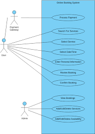

# Requirement Analysis in Software Development

This repository explores the essential phase of **Requirement Analysis** in the Software Development Life Cycle (SDLC). It contains key concepts, diagrams, and examples based on a booking management system case study.

---

## What is Requirement Analysis?

Requirement Analysis is the process of identifying, gathering, and analyzing the needs and expectations of stakeholders for a new or modified product. This phase is critical in the Software Development Life Cycle (SDLC) as it ensures the development team builds a solution that aligns with user needs.

It involves communicating with stakeholders, documenting needs clearly, and validating them to avoid misunderstandings later in the project.

---

## Why is Requirement Analysis Important?

1. **Prevents Miscommunication:** Clarifies stakeholder expectations and prevents costly misunderstandings later in development.
2. **Improves Project Planning:** Offers a clear roadmap for developers, testers, and project managers.
3. **Ensures Product Relevance:** Helps build a solution that solves the actual user problem and meets business goals.

---

## Key Activities in Requirement Analysis

- **Requirement Gathering:** Collecting raw data from stakeholders using interviews, surveys, or observations.
- **Requirement Elicitation:** Asking the right questions to extract true user needs and clarify expectations.
- **Requirement Documentation:** Writing clear, structured documentation that outlines what is expected from the system.
- **Requirement Analysis and Modeling:** Analyzing the requirements and representing them using diagrams or models for better understanding.
- **Requirement Validation:** Reviewing requirements with stakeholders to confirm completeness, correctness, and feasibility.

---

## Types of Requirements

### Functional Requirements

These define **what** the system should do.

Examples (Booking Management System):
- Users can register and log in to their accounts.
- Users can search for available rooms by date.
- Users can make, modify, or cancel a booking.
- Admin can add or remove room listings.

### Non-functional Requirements

These define **how** the system should behave.

Examples:
- The system must support at least 100 concurrent users.
- Booking confirmation should be sent within 3 seconds of successful payment.
- Data should be encrypted during transmission and at rest.
- The UI should be responsive and mobile-friendly.

---

## Use Case Diagrams

Use Case Diagrams show system functionality from a user's perspective. They help identify user interactions and system features, making it easier to understand what the system should do.

---

## Acceptance Criteria

Acceptance Criteria are predefined conditions that a product feature must meet to be accepted by the user or client. They ensure clarity between stakeholders and developers and serve as a reference for testing.

**Example - Checkout Feature in Booking System:**

- **Given** the user has selected a room and entered valid payment details,
- **When** the user clicks on “Confirm Booking,”
- **Then** the system should:
  - Process the payment,
  - Display a booking confirmation page with a unique booking ID,
  - Send a confirmation email to the user with booking details.

---

